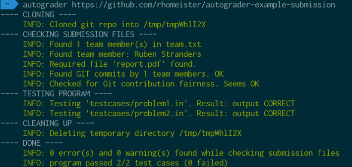

# What does this do?
Autograder is a program for automatically checking and grading students' 
programming projects

# Installation

Follow these instructions to download the code for autograder and install 
the required dependencies:

## Ubuntu

1. `wget https://github.com/rhomeister/autograder/archive/master.zip`
2. `unzip master.zip`
3. `cd autograder`
4. `sudo apt-get -y install python-setuptools`
5. `sudo python setup.py install`

## Windows

Note: these need to be written. Currently inviting help from users

## MacOS

**Install dependencies:**

If you don't have brew and wget, you install them with the following commands:

1. `/usr/bin/ruby -e "$(curl -fsSL https://raw.githubusercontent.com/Homebrew/install/master/install)"`

2. `brew install wget`

If you don't have Python with Setuptools & Pip:

`brew install python`

_Note: MacOS has a python version installed by default, but it doesn't have
Setuptools & Pip by default_

**Install Autograder:**

1. `wget https://github.com/rhomeister/autograder/archive/master.zip`
2. `unzip master.zip`
3. `cd autograder`
4. `sudo python setup.py install`

**Troubleshooting**

If you have any issues during installation, most likely its an issue installing a dependency or you haven't set up the local info. Most of the time it can be solved with the
next steps.

1. Change the ownership from your Python Library

   `sudo chown -R $USER /Library/Python/`

2. Install ez_setup

   `sudo curl https://bootstrap.pypa.io/ez_setup.py -o - | python`

3. Add the required exports to your bash or zsh profile:

   `nano ~/.bash_profile`

    _Paste at the end of the file_:

   `export LC_ALL=en_US.UTF-8`

   `export LANG=en_US.UTF-8`

4. Reload your bash profile

    `source ~/.bash_profile`

5. Retry installing/running Autograder

# Using autograder

## For students

**Note**: _after reading these instructions, it is highly recommended you try creating
a dummy submission to the [example assignment](#example) below._

### Preparation by each individual team member

Setup your Git identity. Every team member must do this, because every team
member will contribute to the code. Follow these steps:
- `$ git config --global user.name "John Doe"`
- `$ git config --global user.email johndoe@example.com`

### The required structure of a project

For a project to be autograder compatible, it must satisfy the following
requirements:

- It must be a git repository
- It must contain the following files in the root of the project:
  - a simple text file `team.txt` with the names of all team members, one per
    line
  - a file `report.pdf` with the report
  - a script/program `run` which runs your program. This file will be called
    with no arguments (see next item)
- The program should read the problem description from stdin, and output to
  stdout. This means that your program will be called using: `run < problem.in`.
  Below are some links to pages that explain how to do this in a couple 
  different languages:
  - **Python**:
    (http://stackoverflow.com/questions/13001212/read-n-test-cases-from-file-in-python) 
  - **Java**: (http://codeforces.com/blog/entry/7018)
  - **C++**: (https://sites.ualberta.ca/~hbrausen/basics/inputoutput.html)
  - (Inviting suggestions for examples for other languages...)
- The program must be correct. This is verified by checking your program against
  a number of test cases. Autograder searches for these testcases in the
  `testcases` directory.
  These test cases can be provided by the teacher, but you can also create your 
  own. Test cases come in pairs:
  - `[filename].in` containing the input supplied to your program
  - `[filename].out` containing the expected output of your program

To verify that your submission satisfies all these requirements, **commit your
work** (locally is sufficient) and **run `autograder`** from the root directory 
of your project.

### Running a pre-submission check
Before submitting your project, do a final check:

- Commit your code and push it to the git repository
- Run autograder against the repository using `autograder [URL]`, where `URL` is
  the clone URL of your project.

**Note** Depending on the class policies, your submission can be rejected if
there are any errors or failed test cases.

## For teachers

To check a students' submission, run:

`autograder --testcasedir [TESTCASEDIR] [URL]`

- `TESTCASEDIR`: the directory with input/output pairs (see above) containing
  problem descriptions you want to test the students' submission against.
- `URL`: the URL of the git repository.

Note: this means that in order to submit their projects, students can simply
send you the URL of their git repository.

# Example

For an example assignment, see this
[repository](https://github.com/rhomeister/autograder-example-assignment).

For an example submission based on the example assignment, see this
[repository](https://github.com/rhomeister/autograder-example-submission).

## Screenshot

Result of executing: 
`autograder https://github.com/rhomeister/autograder-example-submission` 

